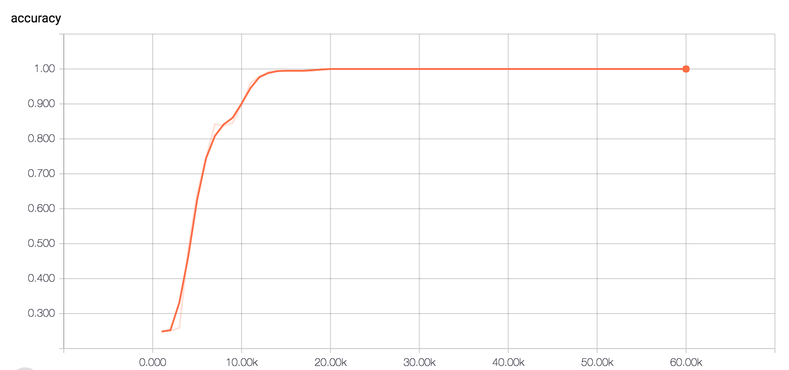
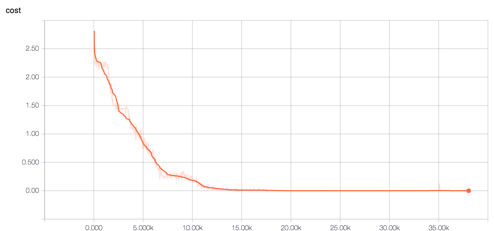
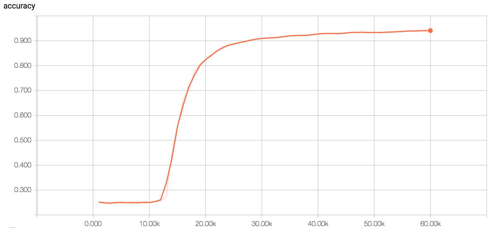
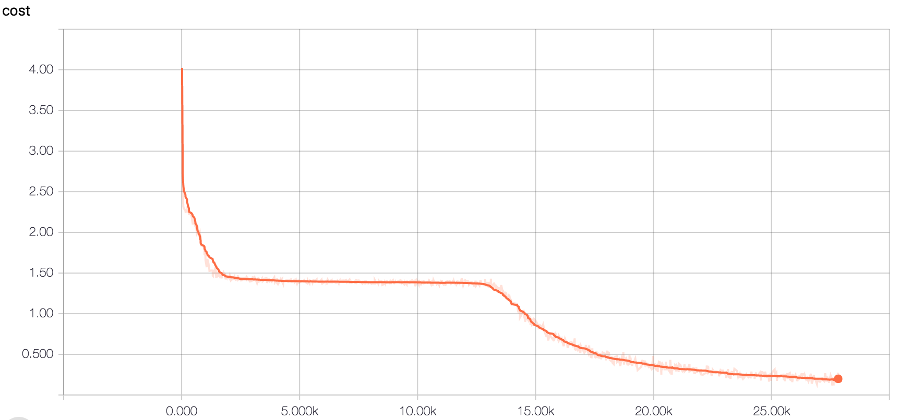

# Using Fast Weights to Attend to the Recent Past

This repo is a TensorFlow implementation of
```
Using Fast Weights to Attend to the Recent Past
Jimmy Ba, Geoffrey Hinton, Volodymyr Mnih, Joel Z. Leibo, Catalin Ionescu
NIPS 2016, https://arxiv.org/abs/1610.06258
```


Specifically, we follow the experiments in `Sec 4.1 Associative retrieval` and try to reproduce the results in Table 1 and Figure 2.
The fast weights model can achieve ***100%*** accuracy (***0%*** error rate) on ***R=50*** setting in ~30K iterations. 

Running result as follows:

*Fast Weights:*


*LSTM*



Both trained on GTX 980 Ti, with TensorFlow 0.11rc1.
Setting on R=50, using TensorFlow default Adam optimizer.

## Train the fast weights model
```
python FW_train.py
```

## Evaluate the fast weights model
```
python FW_eval.py
```

Run the `LSTM` baseline model in similar ways.

### Author
Fan Wu (jxwufan@gmail.com)
